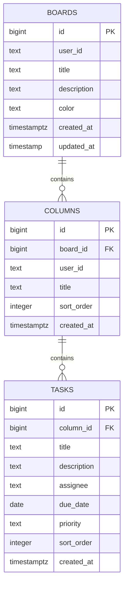

# Database Schema Diagram

## Schema Overview

The database uses **BIGSERIAL** (auto-incrementing 64-bit integers) for primary keys instead of UUIDs for:
- **Better performance**: Integer comparisons and joins are faster than UUID comparisons
- **Smaller index size**: 8 bytes vs 16 bytes per key, reducing storage and memory usage
- **Better cache efficiency**: Sequential integers improve database cache hit rates
- **Simpler debugging**: Human-readable IDs make troubleshooting easier

All timestamps use **TIMESTAMPTZ** (timestamp with time zone) for `created_at` fields to ensure consistent time handling across different timezones.

## Entity Relationship Diagram (ERD)

```
┌─────────────────────────────────────────────────────┐
│                      BOARDS                         │
├─────────────────────────────────────────────────────┤
│ PK │ id              BIGINT                         │
│    │ user_id         TEXT                           │
│    │ title           TEXT                           │
│    │ description     TEXT (nullable)                │
│    │ color           TEXT                           │
│    │ created_at      TIMESTAMPTZ                    │
│    │ updated_at      TIMESTAMP                      │
└─────────────────────────────────────────────────────┘
           │
           │ 1
           │
           │ has many
           │
           │ N
           ▼
┌─────────────────────────────────────────────────────┐
│                     COLUMNS                         │
├─────────────────────────────────────────────────────┤
│ PK │ id              BIGINT                         │
│ FK │ board_id        BIGINT                         │
│    │ user_id         TEXT                           │
│    │ title           TEXT                           │
│    │ sort_order      INTEGER                        │
│    │ created_at      TIMESTAMPTZ                    │
└─────────────────────────────────────────────────────┘
           │
           │ 1
           │
           │ has many
           │
           │ N
           ▼
┌─────────────────────────────────────────────────────┐
│                      TASKS                          │
├─────────────────────────────────────────────────────┤
│ PK │ id              BIGINT                         │
│ FK │ column_id       BIGINT                         │
│    │ title           TEXT                           │
│    │ description     TEXT (nullable)                │
│    │ assignee        TEXT (nullable)                │
│    │ due_date        DATE (nullable)                │
│    │ priority        TEXT (low/medium/high)         │
│    │ sort_order      INTEGER                        │
│    │ created_at      TIMESTAMPTZ                    │
└─────────────────────────────────────────────────────┘
```

## Relationships

### One-to-Many Relationships

1. **Board → Columns** (1:N)
   - One board can have multiple columns
   - Each column belongs to exactly one board
   - Cascade delete: When a board is deleted, all its columns are deleted

2. **Column → Tasks** (1:N)
   - One column can have multiple tasks
   - Each task belongs to exactly one column
   - Cascade delete: When a column is deleted, all its tasks are deleted

### User Relationships

```
┌─────────────────┐
│   CLERK USER    │  (External System)
│─────────────────│
│ user_id (TEXT)  │
└─────────────────┘
         │
         │ owns
         │
         ▼
┌─────────────────┐
│     BOARDS      │──┐
└─────────────────┘  │
                     │ denormalized
┌─────────────────┐  │ for RLS
│    COLUMNS      │◄─┘
└─────────────────┘
```

**Note**: `user_id` is denormalized in the `columns` table for efficient Row Level Security policies.

## Visual Schema Diagram (Mermaid)



## Database Schema SQL

### Complete Schema Creation Script

```sql
-- ============================================
-- BOARDS TABLE
-- ============================================
CREATE TABLE boards (
  id BIGSERIAL PRIMARY KEY,
  user_id TEXT NOT NULL,
  title TEXT NOT NULL CHECK (length(title) > 0),
  description TEXT,
  color TEXT NOT NULL DEFAULT 'bg-blue-500',
  created_at TIMESTAMP WITH TIME ZONE NOT NULL DEFAULT NOW(),
  updated_at TIMESTAMP NOT NULL DEFAULT NOW()
);

-- Indexes for performance
CREATE INDEX idx_boards_user_id ON boards(user_id);
CREATE INDEX idx_boards_created_at ON boards(created_at DESC);
CREATE INDEX idx_boards_updated_at ON boards(updated_at DESC);

-- Comments
COMMENT ON TABLE boards IS 'User boards/projects';
COMMENT ON COLUMN boards.user_id IS 'Clerk user identifier';
COMMENT ON COLUMN boards.color IS 'Tailwind CSS color class';

-- ============================================
-- COLUMNS TABLE
-- ============================================
CREATE TABLE columns (
  id BIGSERIAL PRIMARY KEY,
  board_id BIGINT NOT NULL REFERENCES boards(id) ON DELETE CASCADE,
  user_id TEXT NOT NULL,
  title TEXT NOT NULL CHECK (length(title) > 0),
  sort_order INTEGER NOT NULL DEFAULT 0 CHECK (sort_order >= 0),
  created_at TIMESTAMP WITH TIME ZONE NOT NULL DEFAULT NOW()
);

-- Indexes for performance
CREATE INDEX idx_columns_board_id ON columns(board_id);
CREATE INDEX idx_columns_user_id ON columns(user_id);
CREATE INDEX idx_columns_sort_order ON columns(board_id, sort_order);

-- Comments
COMMENT ON TABLE columns IS 'Kanban board columns/lists';
COMMENT ON COLUMN columns.sort_order IS 'Display order (0-based)';

-- ============================================
-- TASKS TABLE
-- ============================================
CREATE TABLE tasks (
  id BIGSERIAL PRIMARY KEY,
  column_id BIGINT NOT NULL REFERENCES columns(id) ON DELETE CASCADE,
  title TEXT NOT NULL CHECK (length(title) > 0),
  description TEXT,
  assignee TEXT,
  due_date DATE,
  priority TEXT NOT NULL DEFAULT 'medium' 
    CHECK (priority IN ('low', 'medium', 'high')),
  sort_order INTEGER NOT NULL DEFAULT 0 CHECK (sort_order >= 0),
  created_at TIMESTAMP WITH TIME ZONE NOT NULL DEFAULT NOW()
);

-- Indexes for performance
CREATE INDEX idx_tasks_column_id ON tasks(column_id);
CREATE INDEX idx_tasks_sort_order ON tasks(column_id, sort_order);
CREATE INDEX idx_tasks_priority ON tasks(priority);
CREATE INDEX idx_tasks_due_date ON tasks(due_date) WHERE due_date IS NOT NULL;
CREATE INDEX idx_tasks_assignee ON tasks(assignee) WHERE assignee IS NOT NULL;

-- Comments
COMMENT ON TABLE tasks IS 'Individual tasks/cards';
COMMENT ON COLUMN tasks.priority IS 'Task priority: low, medium, or high';
COMMENT ON COLUMN tasks.sort_order IS 'Display order within column (0-based)';

-- ============================================
-- FUNCTIONS & TRIGGERS
-- ============================================

-- Auto-update updated_at timestamp
CREATE OR REPLACE FUNCTION update_updated_at()
RETURNS TRIGGER AS $$
BEGIN
  NEW.updated_at = NOW();
  RETURN NEW;
END;
$$ LANGUAGE plpgsql;

CREATE TRIGGER boards_updated_at
  BEFORE UPDATE ON boards
  FOR EACH ROW
  EXECUTE FUNCTION update_updated_at();

-- ============================================
-- ROW LEVEL SECURITY POLICIES
-- ============================================

-- Enable RLS on all tables
ALTER TABLE boards ENABLE ROW LEVEL SECURITY;
ALTER TABLE columns ENABLE ROW LEVEL SECURITY;
ALTER TABLE tasks ENABLE ROW LEVEL SECURITY;

-- BOARDS POLICIES
CREATE POLICY "Users can view own boards"
  ON boards FOR SELECT
  USING (user_id = auth.uid());

CREATE POLICY "Users can create own boards"
  ON boards FOR INSERT
  WITH CHECK (user_id = auth.uid());

CREATE POLICY "Users can update own boards"
  ON boards FOR UPDATE
  USING (user_id = auth.uid());

CREATE POLICY "Users can delete own boards"
  ON boards FOR DELETE
  USING (user_id = auth.uid());

-- COLUMNS POLICIES
CREATE POLICY "Users can view own columns"
  ON columns FOR SELECT
  USING (user_id = auth.uid());

CREATE POLICY "Users can create own columns"
  ON columns FOR INSERT
  WITH CHECK (user_id = auth.uid());

CREATE POLICY "Users can update own columns"
  ON columns FOR UPDATE
  USING (user_id = auth.uid());

CREATE POLICY "Users can delete own columns"
  ON columns FOR DELETE
  USING (user_id = auth.uid());

-- TASKS POLICIES
CREATE POLICY "Users can view own tasks"
  ON tasks FOR SELECT
  USING (
    column_id IN (
      SELECT id FROM columns WHERE user_id = auth.uid()
    )
  );

CREATE POLICY "Users can create own tasks"
  ON tasks FOR INSERT
  WITH CHECK (
    column_id IN (
      SELECT id FROM columns WHERE user_id = auth.uid()
    )
  );

CREATE POLICY "Users can update own tasks"
  ON tasks FOR UPDATE
  USING (
    column_id IN (
      SELECT id FROM columns WHERE user_id = auth.uid()
    )
  );

CREATE POLICY "Users can delete own tasks"
  ON tasks FOR DELETE
  USING (
    column_id IN (
      SELECT id FROM columns WHERE user_id = auth.uid()
    )
  );
```

## Sample Data

### Example Board Structure
```sql
-- Sample board
INSERT INTO boards (user_id, title, description, color)
VALUES ('user_2abc123XYZ', 'Website Redesign', 'Q1 2026 website redesign project', 'bg-purple-500')
RETURNING id; -- Returns: 1

-- Sample columns (assuming board_id = 1)
INSERT INTO columns (board_id, user_id, title, sort_order)
VALUES 
  (1, 'user_2abc123XYZ', 'To Do', 0),
  (1, 'user_2abc123XYZ', 'In Progress', 1),
  (1, 'user_2abc123XYZ', 'Review', 2),
  (1, 'user_2abc123XYZ', 'Done', 3)
RETURNING id; -- Returns: 1, 2, 3, 4

-- Sample tasks (assuming column_id = 1 for "To Do")
INSERT INTO tasks (column_id, title, description, assignee, due_date, priority, sort_order)
VALUES 
  (1, 'Design homepage mockup', 'Create Figma designs for new homepage', '@designer', '2026-07-20', 'high', 0),
  (1, 'Set up development environment', 'Install Next.js and configure Tailwind', '@developer', '2026-07-15', 'high', 1),
  (1, 'Create color palette', 'Define brand colors and design tokens', '@designer', '2026-07-18', 'medium', 2);
```

## Data Types & Constraints

### Column Constraints

| Table   | Column      | Type        | Constraints                              |
|---------|-------------|-------------|------------------------------------------|
| boards  | id          | BIGSERIAL   | PRIMARY KEY, AUTO INCREMENT              |
| boards  | user_id     | TEXT        | NOT NULL                                 |
| boards  | title       | TEXT        | NOT NULL, CHECK (length > 0)             |
| boards  | color       | TEXT        | NOT NULL, DEFAULT 'bg-blue-500'          |
| boards  | created_at  | TIMESTAMPTZ | NOT NULL, DEFAULT NOW()                  |
| boards  | updated_at  | TIMESTAMP   | NOT NULL, DEFAULT NOW()                  |
| columns | id          | BIGSERIAL   | PRIMARY KEY, AUTO INCREMENT              |
| columns | board_id    | BIGINT      | NOT NULL, FOREIGN KEY                    |
| columns | sort_order  | INTEGER     | NOT NULL, CHECK (>= 0), DEFAULT 0        |
| columns | created_at  | TIMESTAMPTZ | NOT NULL, DEFAULT NOW()                  |
| tasks   | id          | BIGSERIAL   | PRIMARY KEY, AUTO INCREMENT              |
| tasks   | column_id   | BIGINT      | NOT NULL, FOREIGN KEY                    |
| tasks   | priority    | TEXT        | CHECK IN ('low','medium','high')         |
| tasks   | due_date    | DATE        | NULLABLE                                 |
| tasks   | created_at  | TIMESTAMPTZ | NOT NULL, DEFAULT NOW()                  |

### Foreign Key Constraints

| Child Table | Column     | References      | On Delete |
|-------------|------------|-----------------|-----------|
| columns     | board_id   | boards(id)      | CASCADE   |
| tasks       | column_id  | columns(id)     | CASCADE   |

### Cascade Behavior

When a **board** is deleted:
1. All associated **columns** are automatically deleted
2. All **tasks** in those columns are automatically deleted

When a **column** is deleted:
1. All associated **tasks** are automatically deleted

## Indexing Strategy

### Primary Indexes (Automatic)
- `boards.id` (PRIMARY KEY)
- `columns.id` (PRIMARY KEY)
- `tasks.id` (PRIMARY KEY)

### Foreign Key Indexes
- `columns.board_id` - Speed up board→columns queries
- `tasks.column_id` - Speed up column→tasks queries

### Query Optimization Indexes
- `boards.user_id` - Filter boards by user
- `boards.created_at DESC` - Order boards by creation date
- `columns.sort_order` - Order columns within board
- `tasks.sort_order` - Order tasks within column
- `tasks.priority` - Filter tasks by priority
- `tasks.due_date` - Filter/sort tasks by due date (partial index on NOT NULL)

## Query Performance Examples

### Efficient Queries

```sql
-- Get all boards for a user (uses idx_boards_user_id)
SELECT * FROM boards WHERE user_id = 'user_2abc123XYZ';

-- Get columns for a board, ordered (uses idx_columns_sort_order)
SELECT * FROM columns 
WHERE board_id = 1 
ORDER BY sort_order;

-- Get tasks for a column, ordered (uses idx_tasks_sort_order)
SELECT * FROM tasks 
WHERE column_id = 1 
ORDER BY sort_order;

-- Get high priority tasks (uses idx_tasks_priority)
SELECT * FROM tasks WHERE priority = 'high';

-- Get overdue tasks (uses idx_tasks_due_date)
SELECT * FROM tasks 
WHERE due_date < CURRENT_DATE 
  AND due_date IS NOT NULL;
```

### Complex Joined Query
```sql
-- Get full board with columns and tasks
SELECT 
  b.*,
  json_agg(
    json_build_object(
      'id', c.id,
      'title', c.title,
      'sort_order', c.sort_order,
      'tasks', (
        SELECT json_agg(
          json_build_object(
            'id', t.id,
            'title', t.title,
            'description', t.description,
            'priority', t.priority,
            'assignee', t.assignee,
            'due_date', t.due_date
          ) ORDER BY t.sort_order
        )
        FROM tasks t
        WHERE t.column_id = c.id
      )
    ) ORDER BY c.sort_order
  ) as columns
FROM boards b
LEFT JOIN columns c ON c.board_id = b.id
WHERE b.id = 1
GROUP BY b.id;
```

## Schema Migrations

### Using Supabase Migrations

```bash
# Create new migration
supabase migration new create_initial_schema

# Apply migrations
supabase db push

# Reset database
supabase db reset
```

### Version Control
- All schema changes tracked in SQL migration files
- Migrations applied in chronological order
- Rollback support for each migration

## Data Integrity

### Referential Integrity
- Foreign keys ensure valid references
- CASCADE deletes maintain consistency
- CHECK constraints validate data

### Data Validation
- Non-empty strings for titles
- Valid priority values
- Non-negative sort orders
- Proper date formats

## Backup & Recovery

### Point-in-Time Recovery
- Transaction log replay
- Restore to specific timestamp
- Minimal data loss window

### Regular Backups
- Automated daily backups
- 30-day retention (configurable)
- Encrypted at rest

## Performance Considerations

### Estimated Table Sizes

| Table   | Rows per User (avg) | Growth Rate   |
|---------|---------------------|---------------|
| boards  | 5-10                | Low           |
| columns | 20-40               | Low           |
| tasks   | 100-500             | Medium-High   |

### Scalability Metrics
- **10,000 users**: ~500K boards, ~5M tasks
- **100,000 users**: ~5M boards, ~50M tasks

### Optimization Recommendations
- Partition tasks table by created_at for 100K+ users
- Add materialized views for analytics
- Implement archiving for completed boards

## Security Features

### Row Level Security (RLS)
- Automatic enforcement at database level
- User can only access their own data
- Prevents data leaks even if application bug exists

### Authentication Integration
- Uses Clerk user ID via `auth.uid()`
- No direct user table needed
- JWT validation at database level
